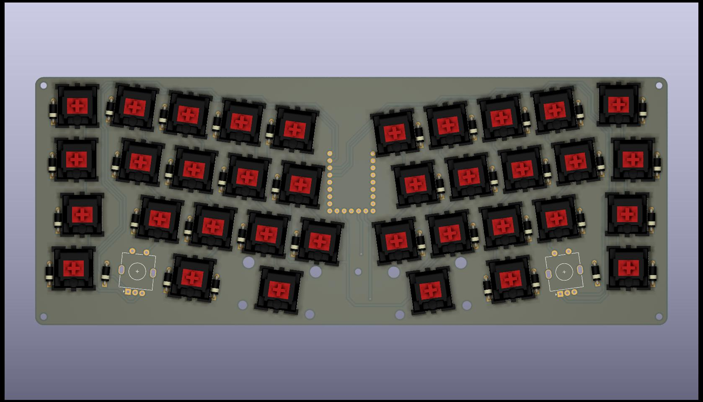
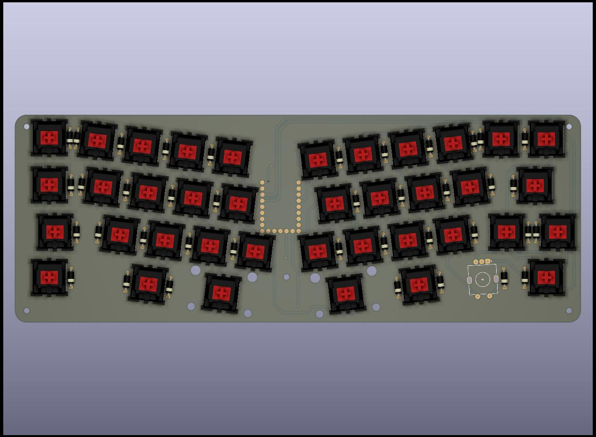
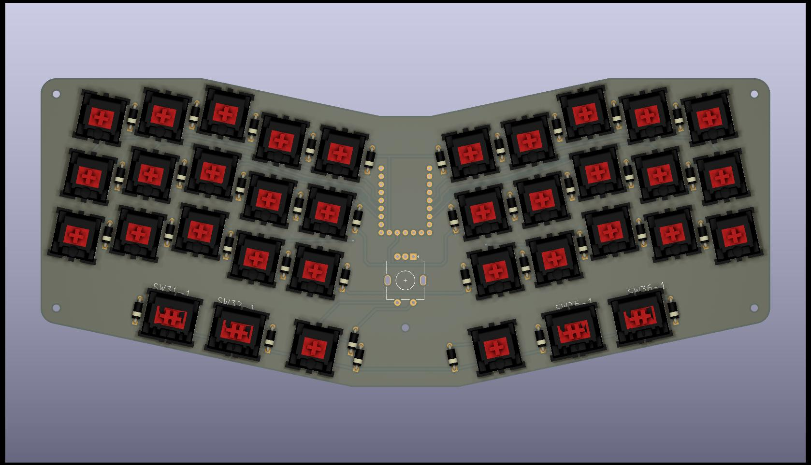
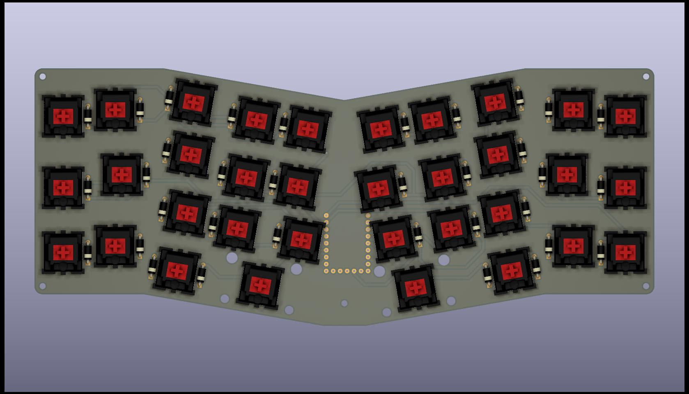
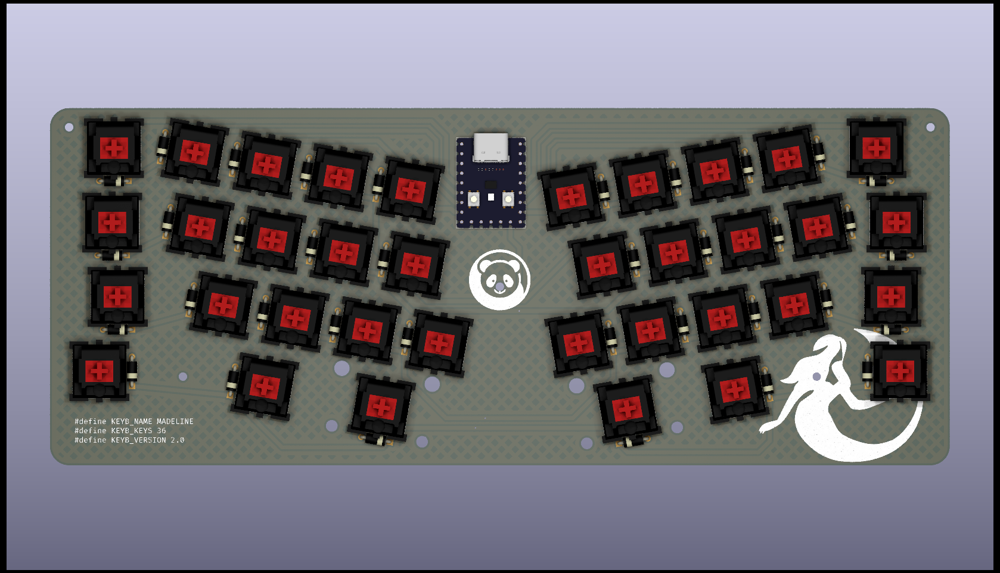

# Keebs

## Ada36(c)/38





## Chiffre36



## Mad34



## Madeline36



## A tester

```
["Q","W","E","R","T","Y","U","I","O",{w:1.75},"Caps Lock","Home","PgUp"],
[{w:1.25},"Ctrl","S","D","F","G","H","J","K","L",{x:0.25,a:7,w:1.25,h:2,w2:1.5,h2:1,x2:-0.25},"",{a:4},"End","PgDn"],
[{w:1.5},"Tab","X","C","V","B","N","M","<\n,",">\n.",{x:1.25},"Insert","Delete"],
["Esc",{w:1.25},"Alt",{x:5.75,w:1.25},"Alt",{w:1.5},"|\n\\","~\n`","Z"],
[{y:-0.75,x:2.5,w:2.75},"Shift",{x:0.25,w:2.25},"Enter"]
```
