# k ... for keybz

| Column1 | Column2 | Column3 | Column4 |
| :-----: | :-----: | :-----: | :------ |
| Item1.1 | Item2.1 | Item3.1 | Item4.1 |

|  Classic   |                                                                       |
| :--------: | --------------------------------------------------------------------- |
|  candybar  |      |
| classic69  |    |
| madeline36 |  |
| madeline38 |  |
|  simple42  |      |
|  simple49  |      |
|  simple52  |      |

|   Ergo   |                                                                |
| :------: | -------------------------------------------------------------- |
|  ergo41  |      |
|  ergo45  |      |
|  ergo46  | 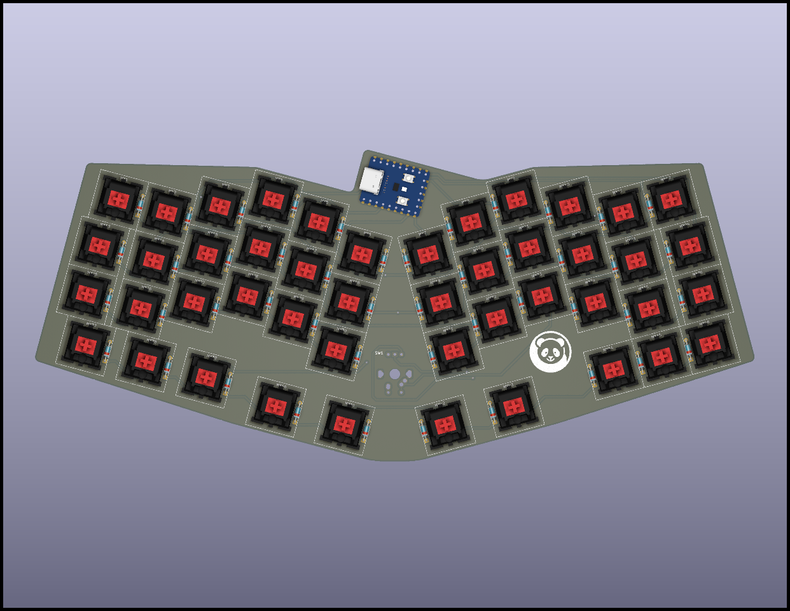     |
| ergo46.1 | 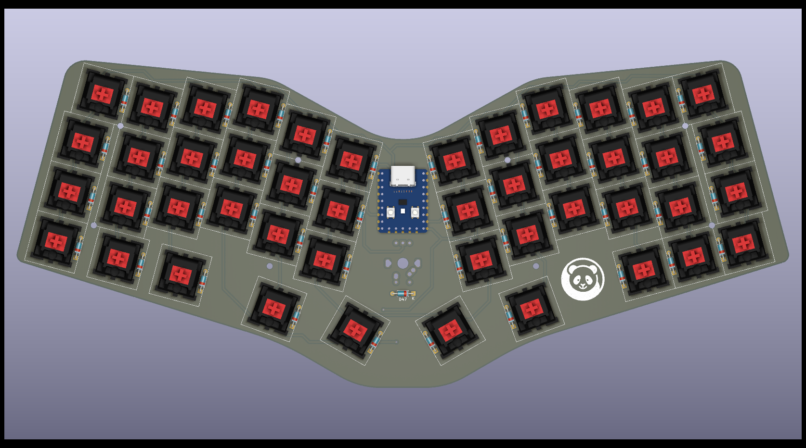 |
|  hill53  | 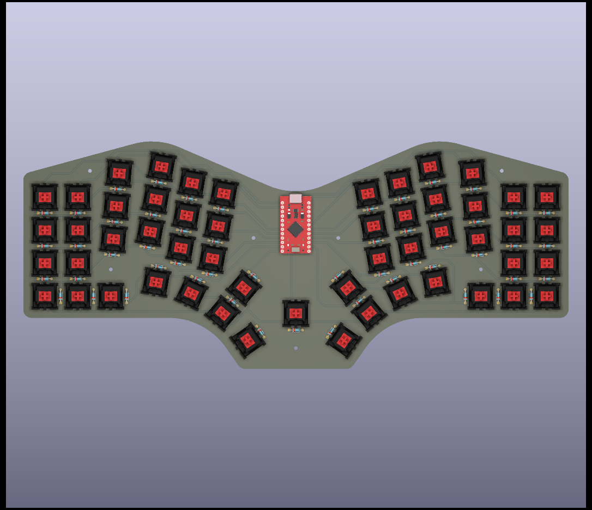     |
| spray44  | 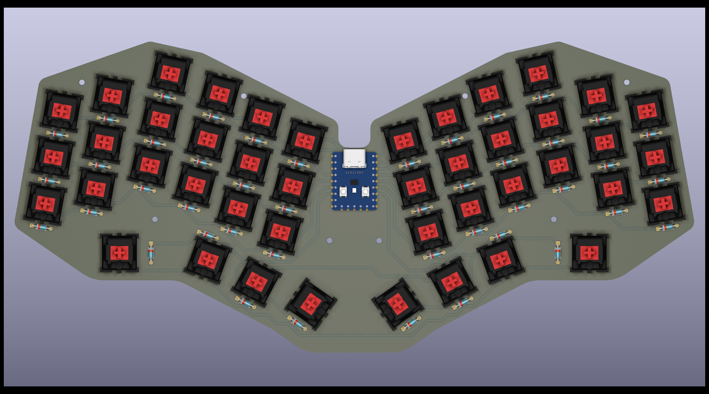   |
| spray46  | 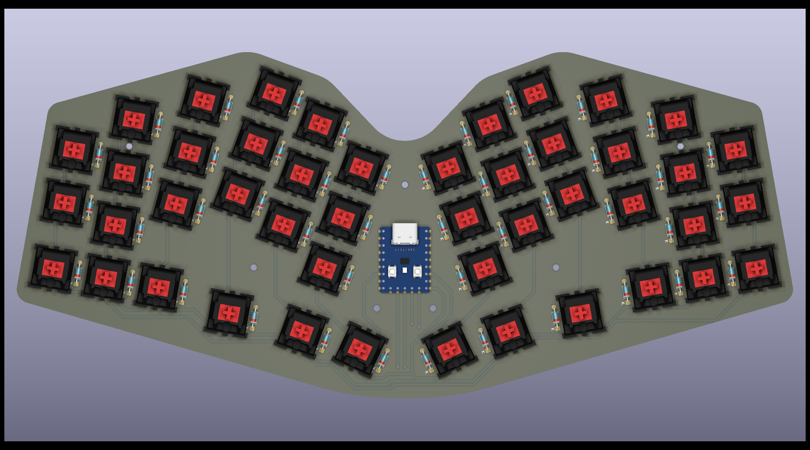   |

|  Others  |                                                                  |
| :------: | ---------------------------------------------------------------- |
| funny42  |    |
|  game43  |      |
| little36 |  |
| little38 |  |

|  Split   |                                                                 |
| :------: | --------------------------------------------------------------- |
| corne36  | 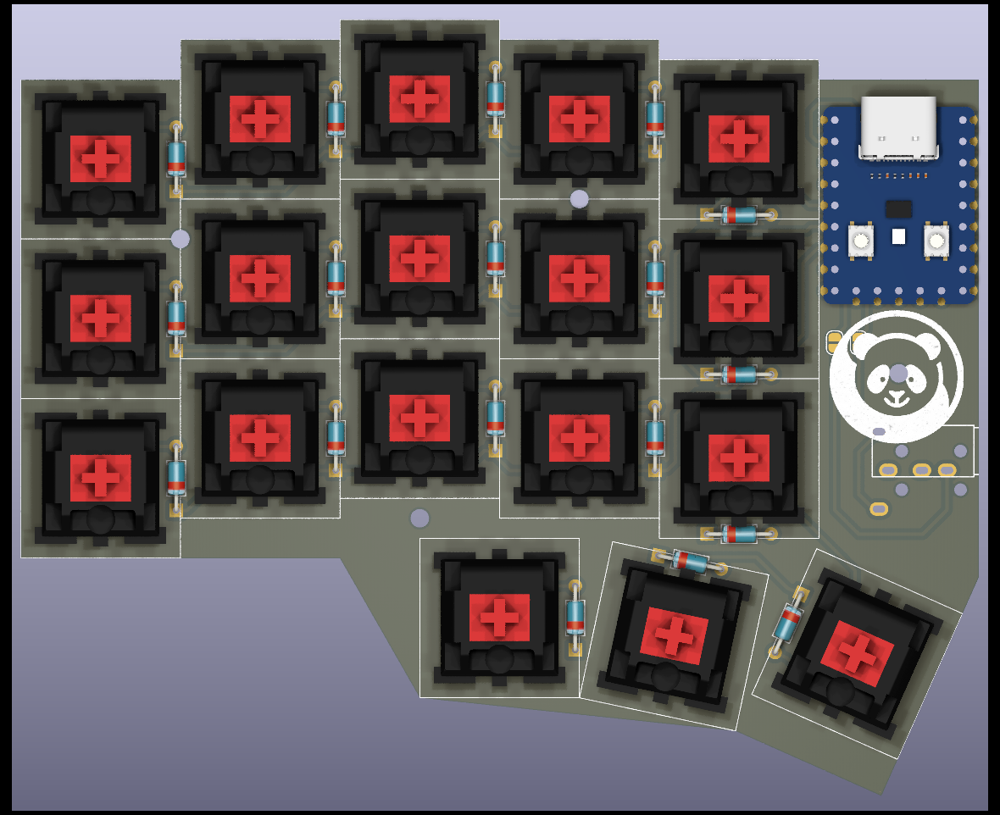   |
| corne42  | 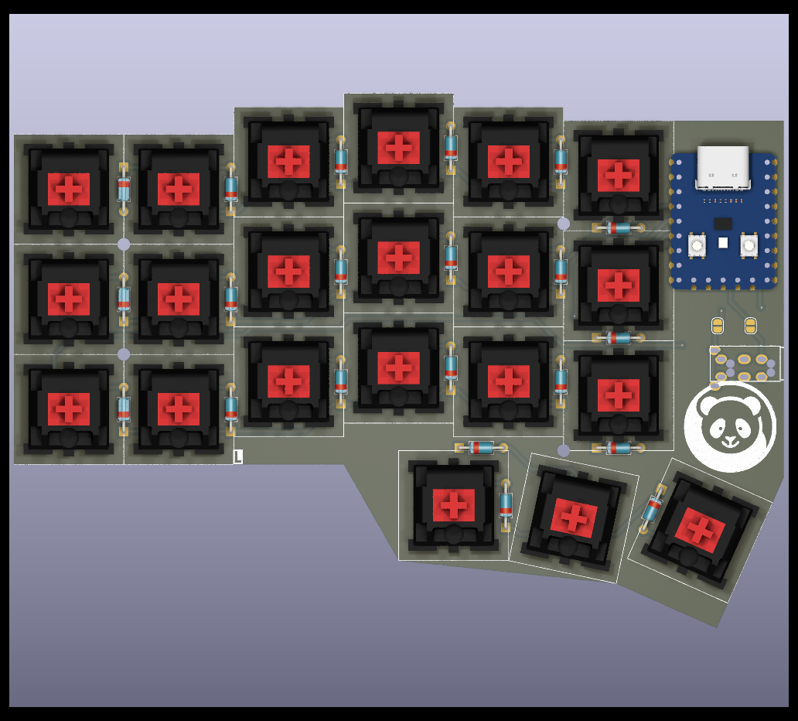   |
| split44  | 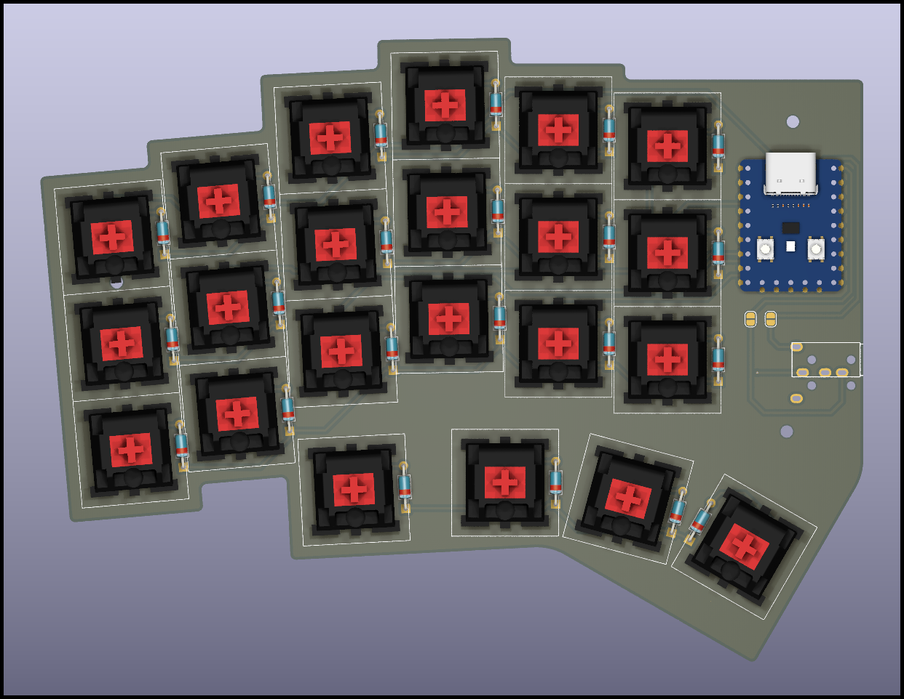   |
| split46  | 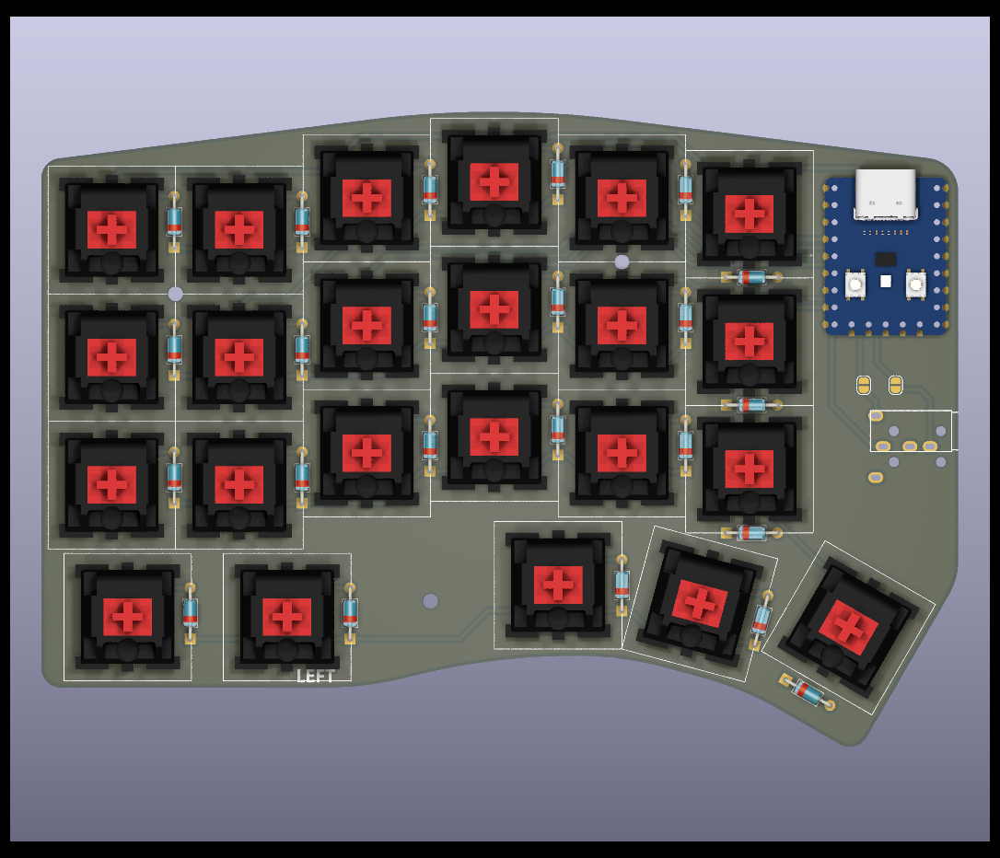   |
| split48  | 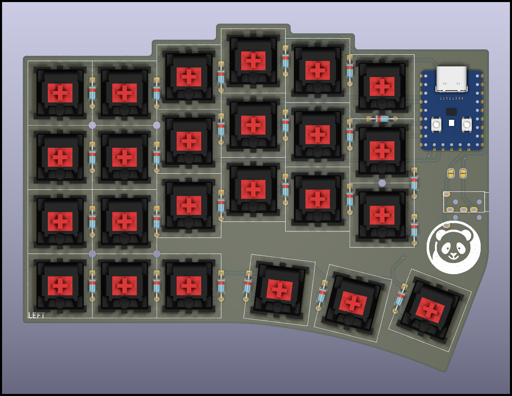   |
| split48s | 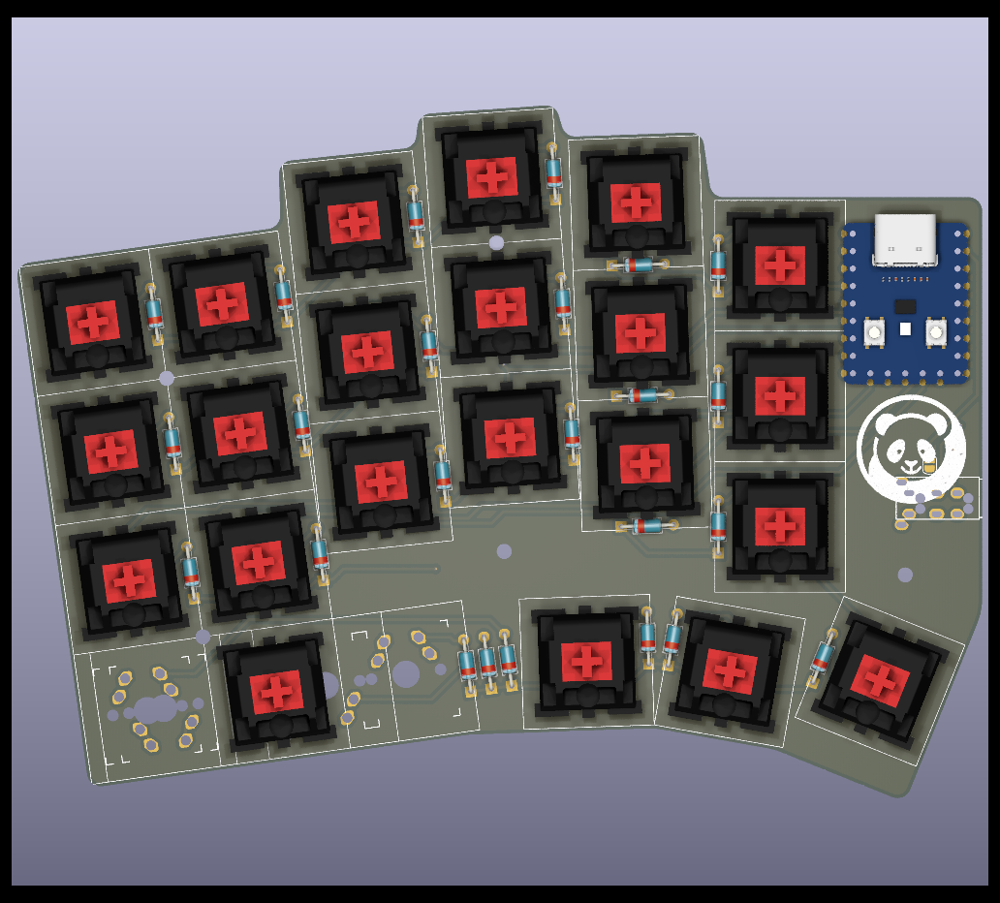 |

---

...
