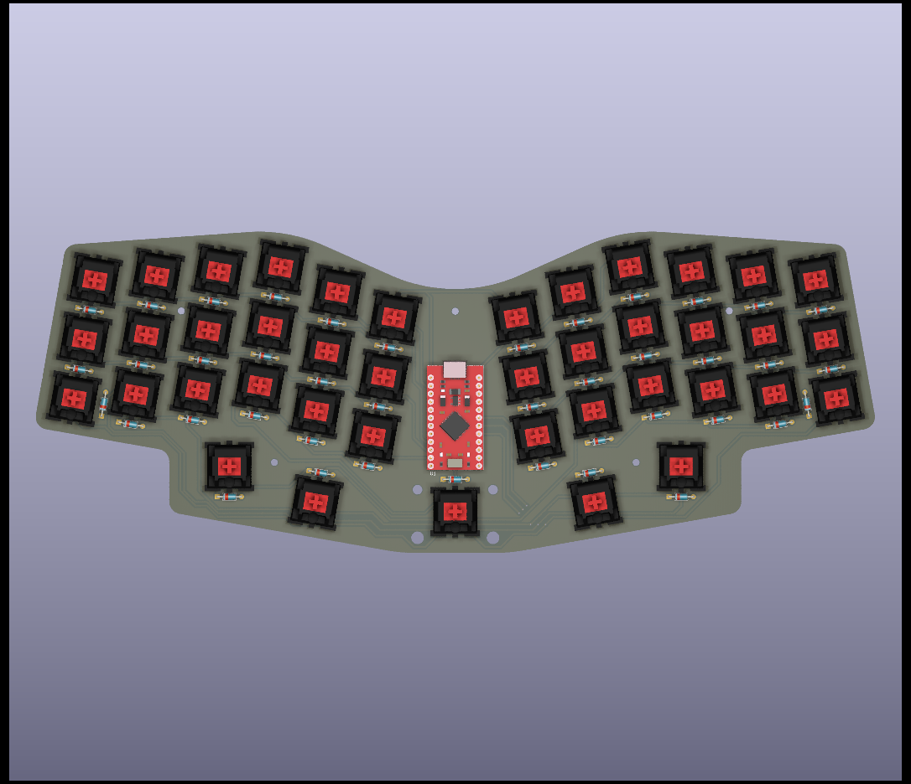
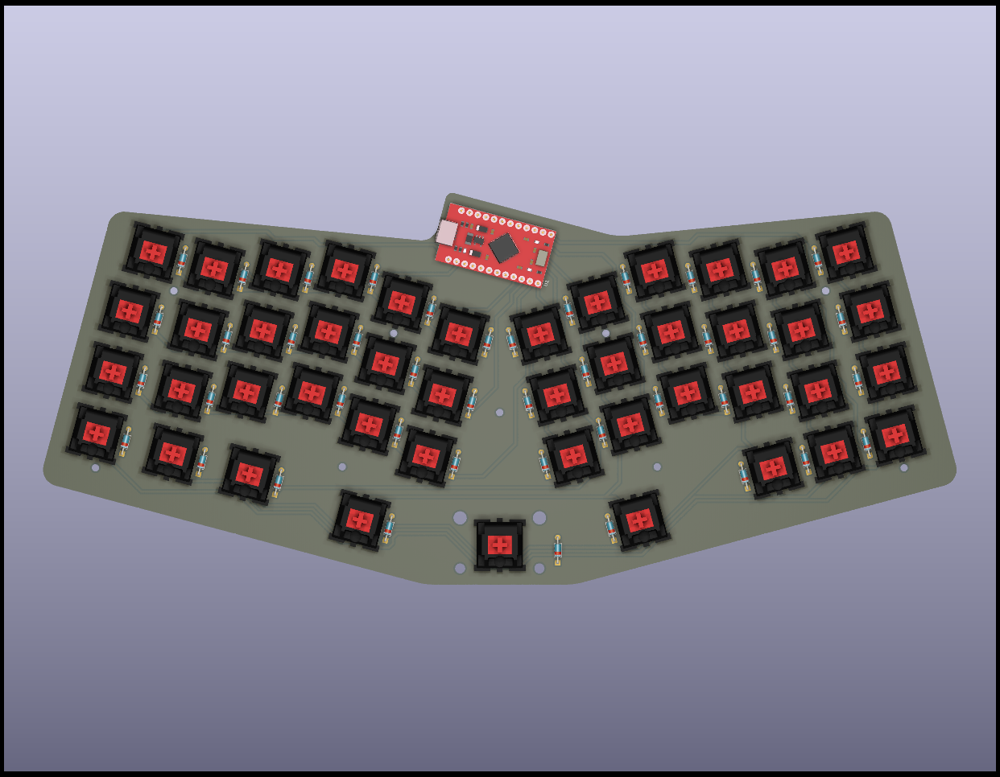
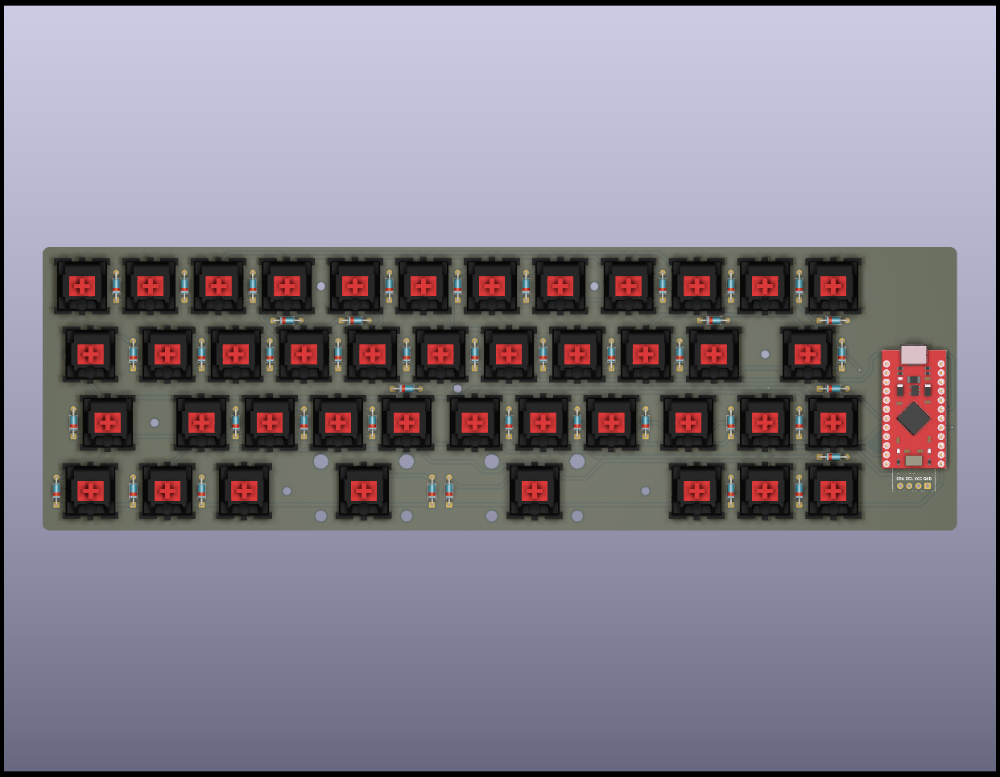
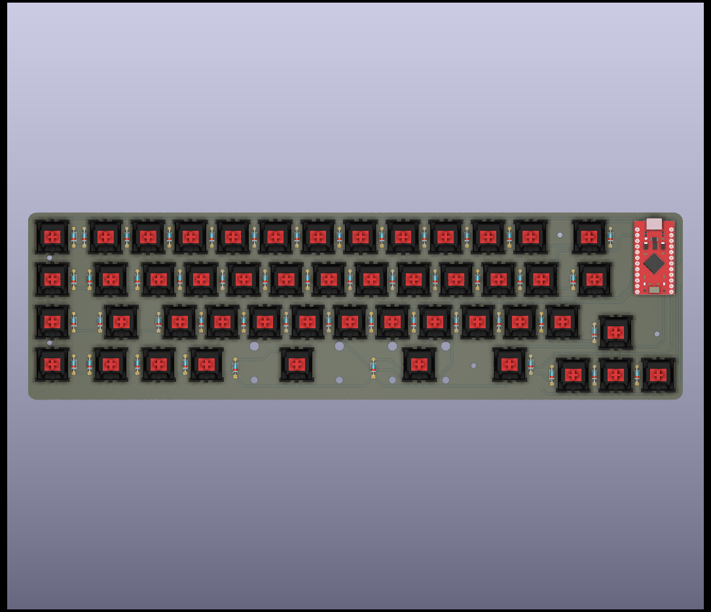
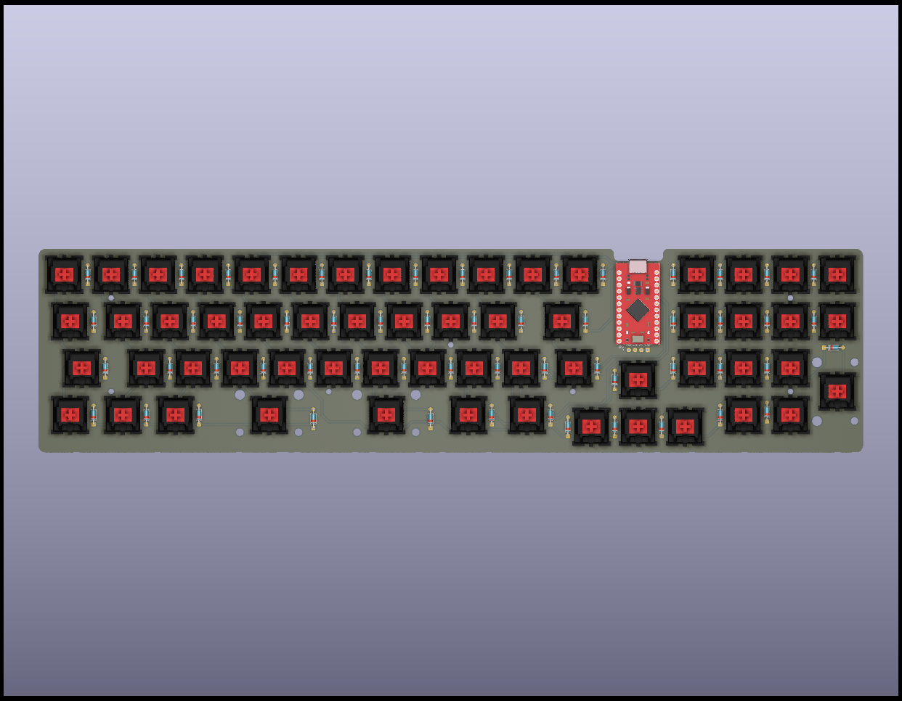
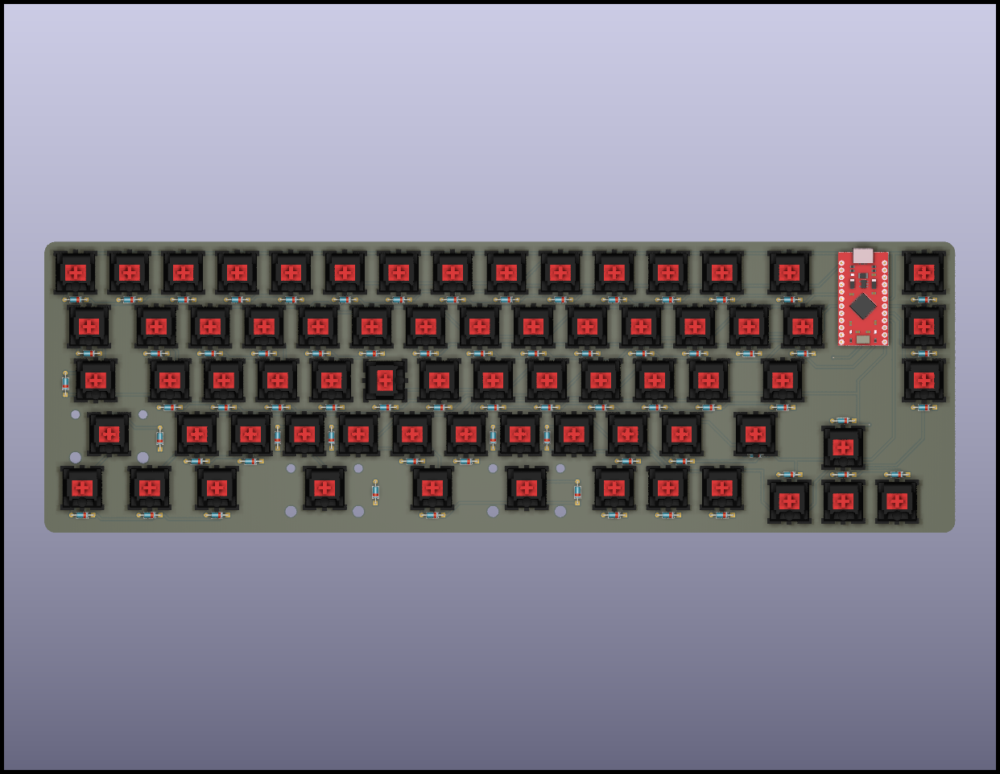
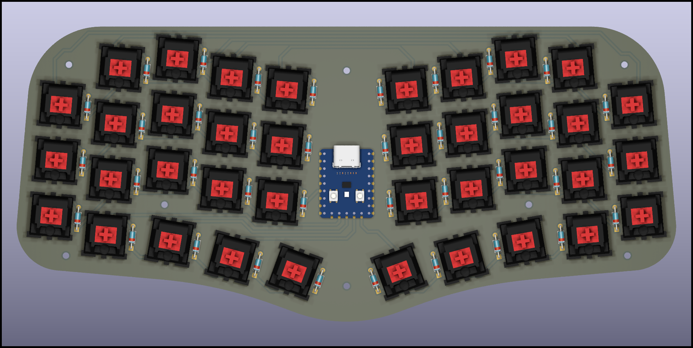
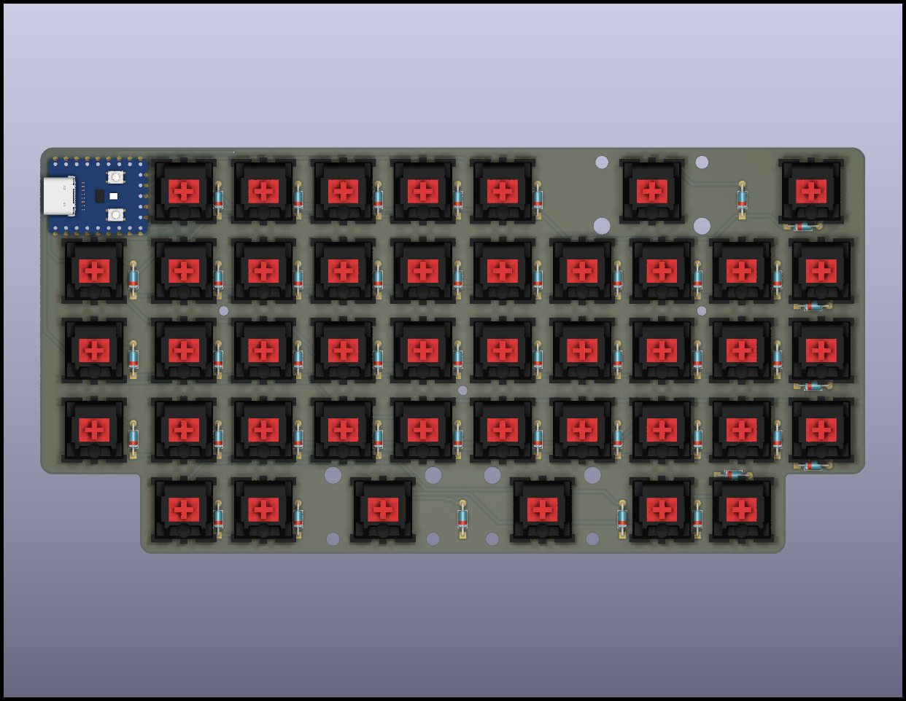
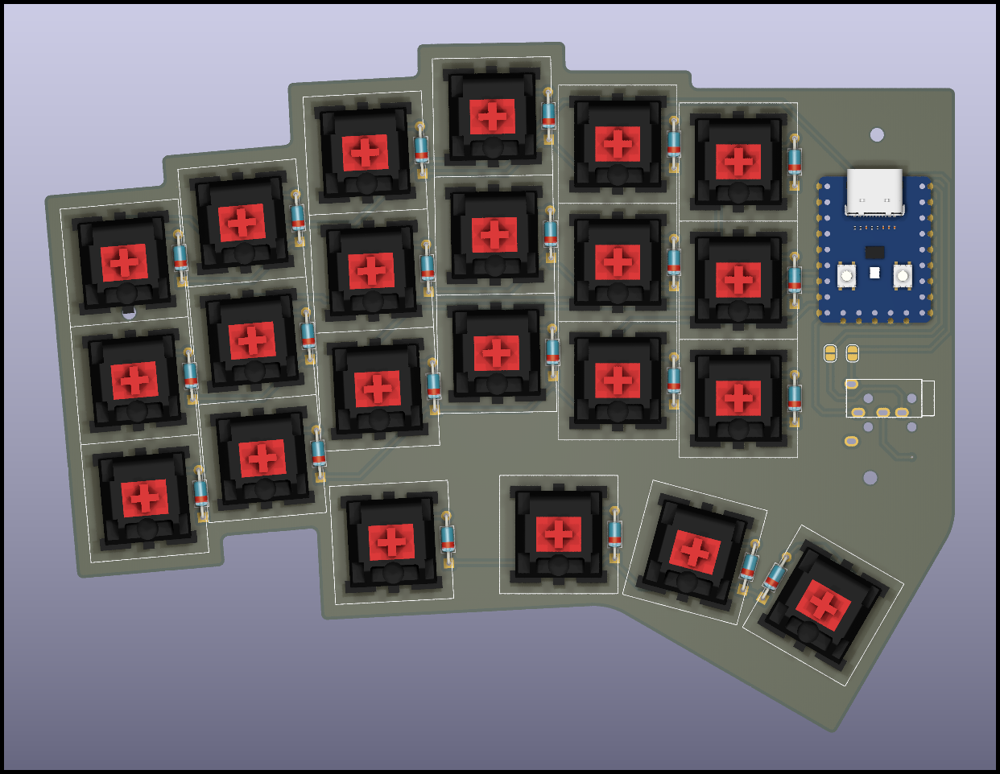
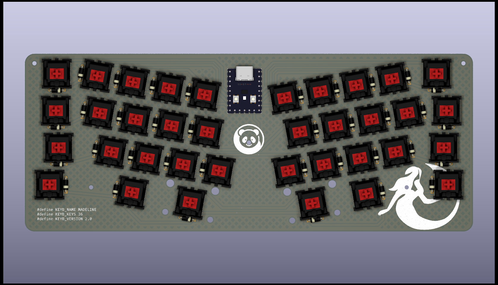

# k ... for keybz

|        Promicro        |                                                               |
| :----------------: | ------------------------------------------------------------- |
|     **ergo41**     |      |
|     **ergo45**     |      |
|     **hill53**     |      |
|    **simple42**    |      |
|    **simple49**    |      |
|    **simple52**    |      |
|    **candybar**    |      |
|   **classic69**    |    |

|        Rp2040        |                                                               |
| :----------------: | ------------------------------------------------------------- |
|  **little36[^1]**  |      |
|  **little38[^1]**  |      |
|   **game43[^1]**   |          |
|  **split46[^1]**   |        |
|  **split44[^1]**   |        |
|  **spray44[^1]**   |        |
|  **spray46[^1]**   |        |
|  **funny42[^1]**   |        |
| **madeline36[^1]** |  |

[^1]: [RP2040-zero](https://www.waveshare.com/wiki/RP2040-Zero)
